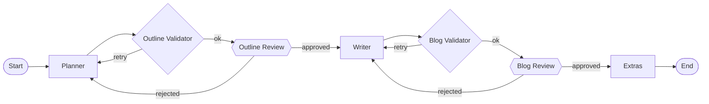

# BlogFlow

A multi-agent technical blog generation system built with **LangGraph** and **FastAPI**. A planner agent drafts an outline, a writer agent expands it into a full article, and a validator agent checks structure at each stage — with a two phase human-in-the-loop review step before anything gets finalized.

## How it works

BlogFlow runs two variants of the same underlying pipeline, compiled as separate LangGraph graphs:

- **`full`** — fully autonomous, no human checkpoints. Planner → validate → (retry up to 3x) → Writer → validate → (retry up to 3x) → Extras → done. Used by `POST /generate`.
- **`review`** — the same pipeline, but pauses (via LangGraph `interrupt`) after the outline and after the draft for human approval or feedback, resuming exactly where it left off using a Postgres-backed checkpointer. Used by the `/outline/*` and `/blog/feedback` endpoints.



*(This is the `review` graph, used by the `/outline/*` and `/blog/feedback` endpoints. The `full` graph used by `/generate` skips the two review checkpoints and retries automatically instead.)*

Each LLM node accumulates token usage and (when available) cost, tracked per-node and totalled across the whole run.

### Agents

| Node | Role |
|---|---|
| **Planner** | Generates a Markdown outline (title, intro, 3–4 sections, conclusion) |
| **Outline Validator** | Structured-output check that the outline is complete; triggers a retry or flags for review |
| **Writer** | Expands the approved outline into an 800–1000 word Markdown article |
| **Blog Validator** | Checks the draft is structurally sound and not truncated |
| **Extras** | Generates alternate titles and social-media hooks from the outline |

## Tech stack

- **FastAPI** — HTTP API, Server-Sent Events streaming
- **LangGraph** — agent orchestration, conditional routing, interrupts, checkpointing
- **LangChain** + **OpenRouter** — LLM calls (`ChatOpenRouter`), structured output for validators
- **PostgreSQL** — `AsyncPostgresSaver` for graph checkpoints (review flow), plus a `generations` table for history
- **LangSmith** — tracing (optional, enabled via env vars)

## Project structure

```
app/
├── main.py          # FastAPI app, routes, SSE streaming
├── graph.py          # Graph definitions (full + review) and routing logic
├── nodes.py           # Agent node implementations
├── prompts.py         # Prompt templates
├── schemas.py         # Structured-output schemas (Validation)
├── state.py            # BlogState TypedDict
├── llm.py               # LLM + validator LLM setup, retries
├── checkpointer.py       # Postgres checkpointer lifecycle
├── sessions.py             # Thread ID helpers, pending-session checks
├── storage.py                # Generation history persistence
frontend/
└── index.html                 # Minimal static frontend
```

## Getting started (local, Docker)

1. Copy the environment template and fill in your keys:
   ```bash
   cp .env.example .env
   ```
2. Start everything (Postgres + API):
   ```bash
   docker compose up --build
   ```
3. API is available at `http://localhost:8000`. Check `GET /health`.

## Environment variables

| Variable | Required | Description |
|---|---|---|
| `OPENROUTER_API_KEY` | ✅ | API key for OpenRouter |
| `OPENROUTER_MODEL` | — | Model slug (default: `openai/gpt-oss-120b:free`) |
| `DATABASE_URL` | ✅ | Postgres connection string (checkpoints + history) |
| `CORS_ALLOW_ORIGINS` | — | Comma-separated allowed origins, or `*` (default) |
| `ENVIRONMENT` | — | `development` (default) or `production` |
| `LANGCHAIN_TRACING_V2` | — | `true` to enable LangSmith tracing |
| `LANGCHAIN_API_KEY` | — | LangSmith API key |
| `LANGCHAIN_PROJECT` | — | LangSmith project name |

## API

| Endpoint | Method | Description |
|---|---|---|
| `/health` | GET | Liveness check |
| `/generate` | POST | Fully autonomous generation, returns the finished post |
| `/outline/start` | POST | Start a reviewed session; streams SSE until the outline pauses for approval |
| `/outline/feedback` | POST | Approve or reject the outline (`session_id`, `approved`, optional `feedback`) |
| `/blog/feedback` | POST | Approve or reject the draft; on approval, finalizes and saves it |
| `/history` | GET | List past generations |
| `/history/{id}` | GET | Full detail for one generation |

### SSE events

The `/outline/start`, `/outline/feedback`, and `/blog/feedback` endpoints stream `text/event-stream` responses with these event types: `token` (streamed LLM output), `node_complete`, `usage`, `interrupt` (pending human review), `complete`, `end`.

## Deployment

Ships with a production-ready `Dockerfile` (non-root user, reads `$PORT` at runtime). Deployable as-is to any Docker-based host — Render, Fly.io, Google Cloud Run, etc. — with an external managed Postgres instance (e.g. Neon, Supabase) for `DATABASE_URL`.

## License

See [LICENSE](./LICENSE).
