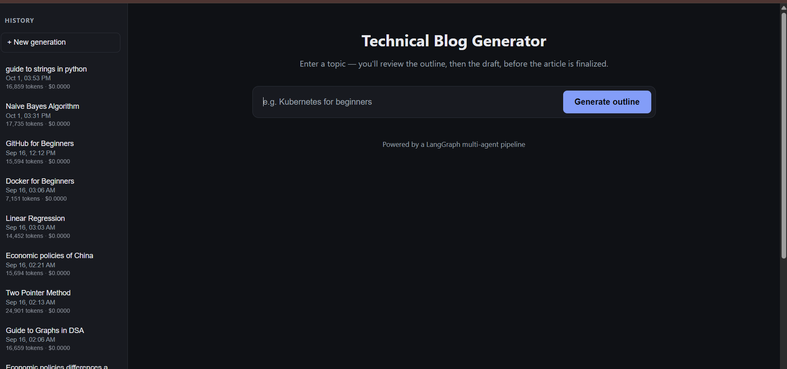
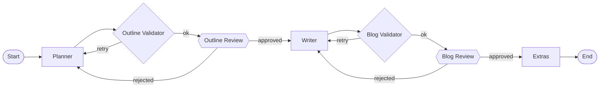
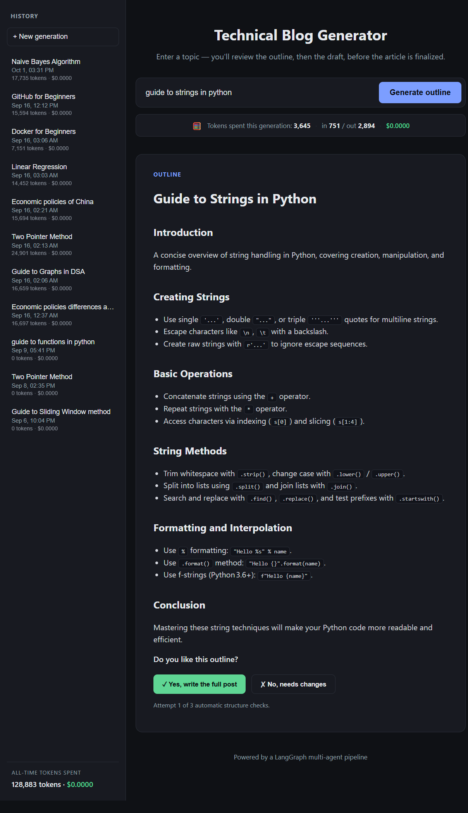
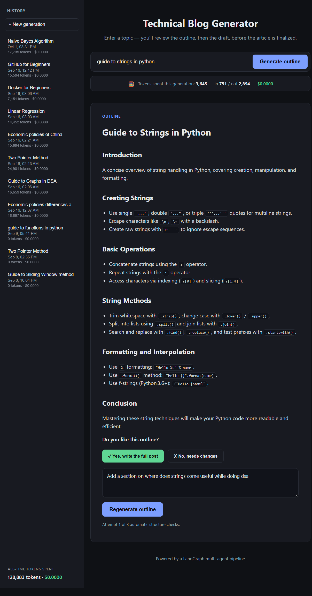
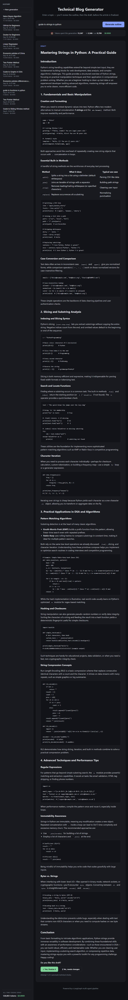
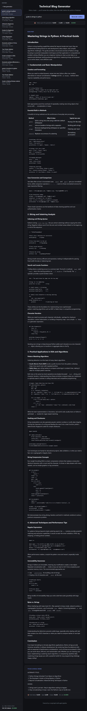

# BlogFlow
 
A multi-agent technical blog generation system built with **LangGraph** and **FastAPI**. A planner agent drafts an outline, a writer agent expands it into a full article, and a validator agent checks structure at each stage — with a two phase human-in-the-loop review step before anything gets finalized.
 

 
## How it works
 
BlogFlow runs two variants of the same underlying pipeline, compiled as separate LangGraph graphs:
 
- **`full`** — fully autonomous, no human checkpoints. Planner → validate → (retry up to 3x) → Writer → validate → (retry up to 3x) → Extras → done. Used by `POST /generate`.
- **`review`** — the same pipeline, but pauses (via LangGraph `interrupt`) after the outline and after the draft for human approval or feedback, resuming exactly where it left off using a Postgres-backed checkpointer. Used by the `/outline/*` and `/blog/feedback` endpoints, and by the bundled frontend.

```mermaid
flowchart LR
    Start([Start]) --> Planner
    Planner --> OutlineValidator{Outline Validator}
    OutlineValidator -->|retry| Planner
    OutlineValidator -->|ok| OutlineReview{{Outline Review}}
    OutlineReview -->|approved| Writer
    OutlineReview -->|rejected| Planner
    Writer --> BlogValidator{Blog Validator}
    BlogValidator -->|retry| Writer
    BlogValidator -->|ok| BlogReview{{Blog Review}}
    BlogReview -->|approved| Extras
    BlogReview -->|rejected| Writer
    Extras --> End([End])
```
 
*(This is the `review` graph, used by the `/outline/*` and `/blog/feedback` endpoints. The `full` graph used by `/generate` skips the two review checkpoints and retries automatically instead.)*
 
Each LLM node accumulates token usage and (when available) cost, tracked per-node and totalled across the whole run.
 
### Agents
 
| Node | Role |
|---|---|
| **Planner** | Generates a Markdown outline (title, intro, 3–4 sections, conclusion) |
| **Outline Validator** | Structured-output check that the outline is complete; triggers a retry or flags for review |
| **Writer** | Expands the approved outline into an 800–1000 word Markdown article |
| **Blog Validator** | Checks the draft is structurally sound and not truncated |
| **Extras** | Generates alternate titles and social-media hooks from the outline |
 
## Frontend
 
A minimal static frontend (`frontend/index.html`) drives the `review` flow end to end. It streams LLM output live over SSE, renders the outline and draft as Markdown with syntax-styled code blocks, and keeps a running tally of token usage and cost.
 
### Walkthrough
 
**1. Enter a topic.** The sidebar lists past generations (title, timestamp, tokens, cost) and shows all-time token spend at the bottom. Click any entry to reopen the finished post.
 

 
**2. Review the outline.** The planner's outline streams in, with a live counter of tokens spent for this generation (input / output / cost). Approve it to start writing the full post, or reject it. The footer shows how many automatic structure-check attempts the validator used (e.g. "Attempt 1 of 3").
 

 
**3. Request changes (optional).** Choosing "No, needs changes" opens a feedback box. Describe what you want changed (e.g. *"Add a section on where strings come in useful while doing DSA"*) and click **Regenerate outline**; the planner revises using your feedback.
 

 
**4. Review the draft.** Once the outline is approved, the writer expands it into a full article. The same approve / request-changes loop applies before anything is finalized.
 

 
**5. Final post.** On approval, the post is finalized and saved to history, along with alternate titles, social-media hooks, and a token/cost breakdown (total, input, output, est. cost).
 

 
### Running the frontend
 
The frontend is a single static file. Serve it with any static server (for example the VS Code Live Server extension on `http://127.0.0.1:5500/frontend/index.html`) while the API runs on `http://localhost:8000`. If you serve it from a different origin than the API, make sure that origin is allowed via `CORS_ALLOW_ORIGINS` (the default `*` allows everything).
 
## Tech stack
 
- **FastAPI** — HTTP API, Server-Sent Events streaming
- **LangGraph** — agent orchestration, conditional routing, interrupts, checkpointing
- **LangChain** + **OpenRouter** — LLM calls (`ChatOpenRouter`), structured output for validators
- **PostgreSQL** — `AsyncPostgresSaver` for graph checkpoints (review flow), plus a `generations` table for history
- **LangSmith** — tracing (optional, enabled via env vars)
- **Vanilla HTML/CSS/JS** — frontend, no build step
## Project structure
 
```
app/
├── main.py          # FastAPI app, routes, SSE streaming
├── graph.py          # Graph definitions (full + review) and routing logic
├── nodes.py           # Agent node implementations
├── prompts.py         # Prompt templates
├── schemas.py         # Structured-output schemas (Validation)
├── state.py            # BlogState TypedDict
├── llm.py               # LLM + validator LLM setup, retries
├── checkpointer.py       # Postgres checkpointer lifecycle
├── sessions.py             # Thread ID helpers, pending-session checks
├── storage.py                # Generation history persistence
frontend/
└── index.html                 # Static frontend (review flow, history, token tracking)
docs/
└── screenshots/                # README screenshots
```
 
## Getting started (local, Docker)
 
1. Copy the environment template and fill in your keys:
```bash
   cp .env.example .env
```
2. Start everything (Postgres + API):
```bash
   docker compose up --build
```
3. API is available at `http://localhost:8000`. Check `GET /health`.
4. Open `frontend/index.html` through a static server (see [Running the frontend](#running-the-frontend)) and enter a topic.
## Environment variables
 
| Variable | Required | Description |
|---|---|---|
| `OPENROUTER_API_KEY` | ✅ | API key for OpenRouter |
| `OPENROUTER_MODEL` | — | Model slug (default: `openai/gpt-oss-120b:free`) |
| `DATABASE_URL` | ✅ | Postgres connection string (checkpoints + history) |
| `CORS_ALLOW_ORIGINS` | — | Comma-separated allowed origins, or `*` (default) |
| `ENVIRONMENT` | — | `development` (default) or `production` |
| `LANGCHAIN_TRACING_V2` | — | `true` to enable LangSmith tracing |
| `LANGCHAIN_API_KEY` | — | LangSmith API key |
| `LANGCHAIN_PROJECT` | — | LangSmith project name |
 
## API
 
| Endpoint | Method | Description |
|---|---|---|
| `/health` | GET | Liveness check |
| `/generate` | POST | Fully autonomous generation, returns the finished post |
| `/outline/start` | POST | Start a reviewed session; streams SSE until the outline pauses for approval |
| `/outline/feedback` | POST | Approve or reject the outline (`session_id`, `approved`, optional `feedback`) |
| `/blog/feedback` | POST | Approve or reject the draft; on approval, finalizes and saves it |
| `/history` | GET | List past generations |
| `/history/{id}` | GET | Full detail for one generation |
 
### SSE events
 
The `/outline/start`, `/outline/feedback`, and `/blog/feedback` endpoints stream `text/event-stream` responses with these event types: `token` (streamed LLM output), `node_complete`, `usage`, `interrupt` (pending human review), `complete`, `end`.
 
The frontend uses `token` events to render output live, `usage` events to update the per-generation token/cost counter, and `interrupt` events to show the approve / request-changes controls.
 
## License
 
See [LICENSE](./LICENSE).
 
